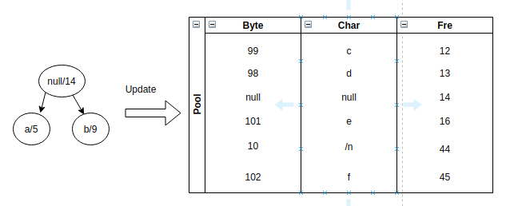
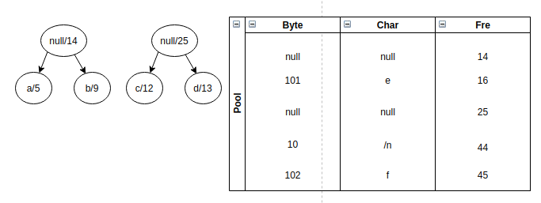
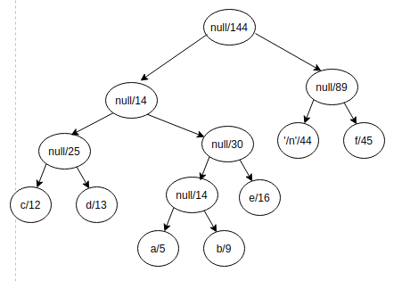
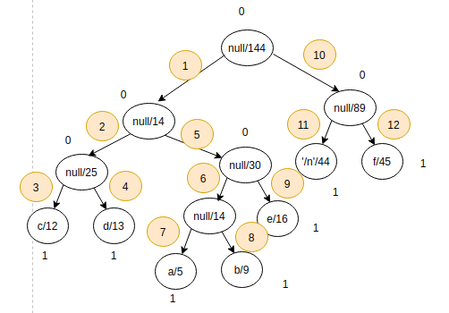

# Rapport de Projet - Module VV - Master 2 ILA 

# Les techniques de tests qu'on a utilisées 
1. Premièrement on a commencé par créer les tests de base, on a utilisé le standard Junit qui permet de nous offrir beaucoup de fonctionnalités de test, afin d'avoir une parfaite couverture du code.
2. Deuxièmement, afin d'avoir une meilleure qualité du produit qu'on a implémenté, on a utilisé l'outil propre a gitlab Code quality qui permet de nous donner des informations sur notre qualité de code afin d'améliorer au maximum notre implémentation .
3. Finalement, on a utilisé PMD qui est un outil qu'on a intégré dans le pom.xml ,dans l'objectif d'avoir une analyse statique du code (éléminer les imports non utilisés, les variables non utilisées...).   
# Présentation de l'algorithme de compression 
## Huffman
### Encode:
L'algorithme d'huffman utilisé dans le projet se base sur la fréquence des répétitions des octets, voici les étapes suivies pour arriver à un tell résultats:
1. Calcule des fréquences d'apparition des octets:
Cette étape consiste à parcourir le fichier est la génération d'une Map<Byte,Integer> (chaque octet avec son nombre d'apparition dans le fichier original).
2. Préparation des données pour la génération de l'arbre d'Huffman.
notation Noeud(gauche,droite,Pair<Representation en octet, Frequence en entier>);
- Depuis notre Map<Byte,Integer> on crée une list de feuille Noeud(Byte,Integer) qu'on vas la noter listDeNoeud. 
- On trie la lisDeNoeud en ordre croissant.
3. Génération d'un arbre d'Huffman
B = 2eme de listDeNoeud
A = 1er de listDeNoeud
- si on a un seul element dans listDeNoeud notre racine est égale à ce noeud
- sinon 
    1. on crée un noeud père P = Noeud(A,B,Pair<null,some de frequence de (A+B)>)
    2. on supprime les 2 noeuds (A et B ) de la listDeNoeud et on rajoute P dans cette list
    3. on retrie la listDeNoeud.
on repete ces 3 point jusqua obtenir un seul Noeud qui serait le Noeud racine de notre arbre
4. Compression du fichier originale
    1. génération d'un String (avec des "0" et des "1") qui correspond aux bit du fichier encoder (sans ajout d'une information)
        on parcours notre fichier originale et pour chaque octet on écrit sa représentation avec notre arbre de huffman
        écrire la représentation depuis l'arbre de huffman:
        depuis un octet dans le fichier originale on cherche son noeud dans l'arbre de huffman on demarant de la racine et on écrivant "0" si on part à gauche "1" à droite)
    2. ajout d'un octect d'information
        - 1er bit tout à gauche représente l'algorithme 0 pr LZW et 1 pour Huffman
        - 3 prochaine bit représente le nombre de bit ajouté au fichier encoder pour arrivé a faire des octet au complet
        - 3 prochaine bit représente le nombre de bit ajouté au fichier qui encode l'arbre pour arrivé a faire des octet au complet 
        - 1 prochaine bit ne donne aucune infomation
    3. concatener les string généré par l'étape 4.2 et 4.1
5. Encoder l'arbre de Huffman dans un fichier
    1. partant de notre représentation générer en 3
    2. chaque noeud pere on marque 0 et noeud fils 1
    3. le parcours se fait en profendeur commencent par la gauche

Exemple:
1. Imaginons qu'on a un fichier text qui comporte ces charactere avec une tel fréquence
<table>
  <tr>
    <td>byte</td>
    <td>char</td>
    <td>Freq</td>
  </tr>
  <tr>
    <td>97</td>
    <td>a</td>
    <td>5</td>
  </tr>
  <tr>
    <td>98</td>
    <td>b</td>
    <td>9</td>
  </tr>
  <tr>
    <td>99</td>
    <td>c</td>
    <td>12</td>
  </tr>
  <tr>
    <td>100</td>
    <td>d</td>
    <td>13</td>
  </tr>
  <tr>
    <td>101</td>
    <td>d</td>
    <td>16</td>
  </tr>
  <tr>
    <td>102</td>
    <td>d</td>
    <td>45</td>
  </tr>
  <tr>
    <td>10</td>
    <td>\n</td>
    <td>44</td>
  </tr>
</table>
poids du fichier originale = 44*8+45*8+16*8+
2. étape 2 + 3:

continuons le process jusqu'a arriver a ce résultat:

3. Compression d'un fichier
a chque caractere rencontrer on le modifier avec son encodage dans l'arbre exemple:
- a = "0100"
- b = "0101"
- c = "000"
- d = "001"
- e = "011"
- f = "11"
- \n = "10"

pour notre exemple on aura:
5*4+9*4+12*3+13*3+16*3+45*2+44*2 = 357bit = 44 byte + 5 bit
on doit ajouter 2 bit pour le rendre a 45byte et on garde cette information dans notre 1er byte du fichier encoder
"1010XXX0"

compression de notre arbre:
la compression suit le chemin indéquer sur le schéma suivant:

on aura pour resultat:
Noter que les caractere que je vais noter ci-dessous seront en octet
0001c1d100a1b1e10'\n'1f
on aura 69 bit = 8 Byte + 5 bit
on doit ajouter 2 bit pour le rendre a 9 byte et on garde cette information dans notre 1er byte du fichier encoder
"10100100"

### Decode:
Pour decoder notre programme a besoin du ficher encoder et le fichier qui comporte l'encodage de l'arbre
1. récupérer les information du 1er byte dans le fichier encoder.
2. supprimer les bits ajouté dans les 2 fichiers
3. reconstruire l'arbre depuis le fichier d'encodage de l'arbre.
4. reconstruire le fichier originale depuis le fichier d'encodage du fichier originale

## LZW
### Encode
L'implémentation de l'algorithme Lzw utilisé dans notre projet se base sur l'utilisatoion d'un dictionnaire, et une table de codage , le principe de cet algorithme en lisant une séquence de symbole, ensuite on les convertis en codage 12 , ça permet de reduire la la taille de fichier . 
on resume les étapes de notre implémentation pour l'algorithme LZW :
1. la création d'une table de codage de taille 4096. 
2. les code de 0 à 255 sont attribué pour représenté les octets du fichier d'entrée. 
3. Pour le processus de compression on utilise les reste de la taille de la table de codage (256 à 4056).
4. identification des redendances des séquences , et on les enregistre dans la table de codage en utilisant un seul numéro.la raison pour laquelle on a maximisé la taille(4096) afin que le processus ne soit pas surchargé de mémoire
5. Généralement chaque caractére est stocké sur 8 bits , ce qui permet jusqu'a 256 symboles unique pour les donneés.Il est nécessaire que les codes soient plus longs en bits que les caractéres (12 bits), mais comme de nmobreuses sequences seront remplacées par un seul code.

### Decode

Pour la partie de décompression, c'est le même principe de la compression, on travaille avec une séquence de 3 octets, pour la conversion du codage sur 12 bits a un code sur 8 bits. 
1. la création d'une table de codage de taille 4096.
2. on commence par les 256 premières caractères de tables initialisées en caractère unique à l'exception du premier. 
3. on fait la mise à jour du codage 12 bits à un codage 8 bits. 
4. faire la conversion pour récupérer les caractères de la table de codage. 

# Les problèmes qu'on a rencontrés
1. Récupération de tout le contenu du fichier à la fois est essayé de le traiter.
2. manipulation du type string pour des longs caractères entraine bourrage de la mémoire -> exécution lente ou jusqu'à atteindre OutofMemory
3. Comment coder l'arbre de Huffman on optimisent au maximum le stockage
4. Réalisation du projet pendant la période de l'entreprise (moins d'interaction entre les binômes) ce qui nous a empêché de définir un standard pour decoder un fichier sans connaitre l'algorithme de l'encodage
5. L'arbre d'huffman est un fichier séparer du fichier encoder (comment rassembler les 2), sans augmenter le stockage.
6. La manipulation des octets, c'est un peu complexe en matière de conversion. 
7. La difficulté de mettre en place des pipelines. 
 

# Solution:
1. Utilisation de StringBuilder améliore considérablement les performances
2. Utilisation des Thread (SchedulerExecutors pour les taches qu'on peut perfomrer en parallele)

# about piplines
## Stages
## 1 - code_quality
    use gitlab-ci code quality will generate **gl-code-quality-report.json**
## 2 - test
    use mvn test commnd to run JUNIT-test
# this project use PMD apache plugin for static analyzing
    when the pipeline are done there are an artifact containt /target/ folder 
    for the build, we can show PMD result in /target/pmd.xml
